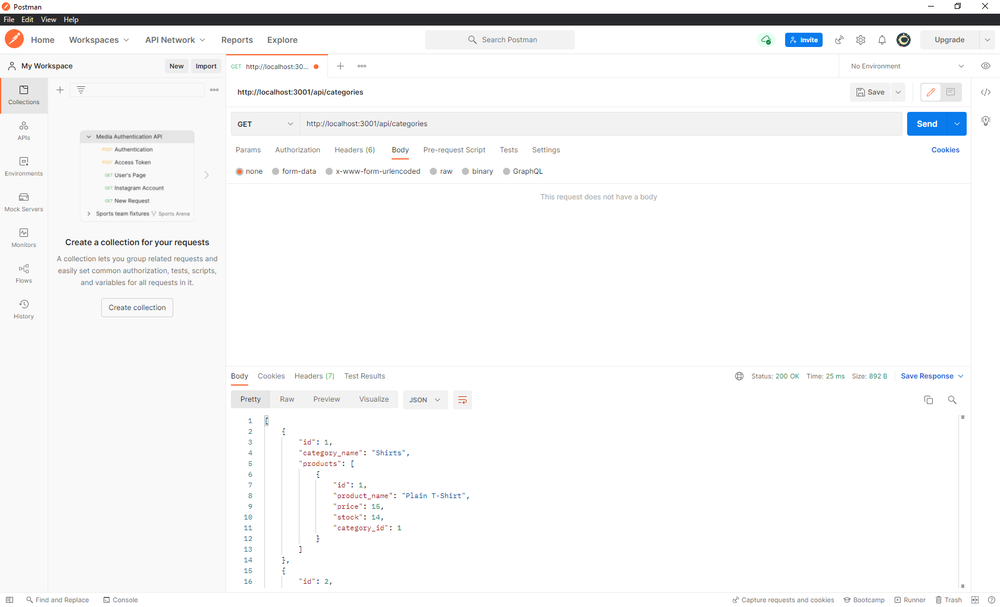
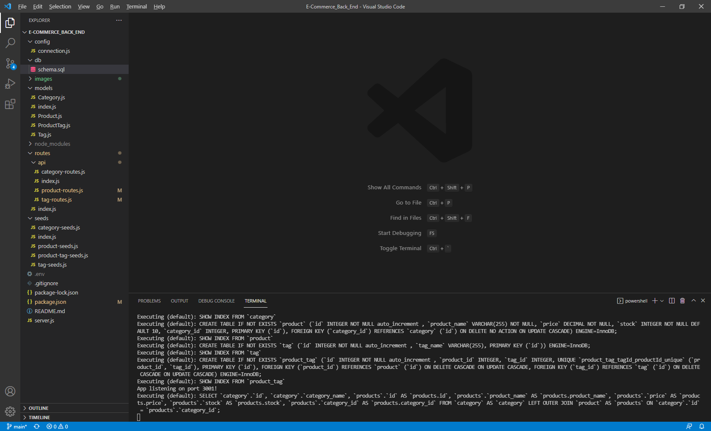

# E-Commerce_Back_End

## Description
Allows a user to interact with a database of consumer products

## Table of Contents

- [Links](#links)
- [Example](#example)
- [Installation](#installation)
- [Usage](#usage)
- [License](#license)
- [Contributing](#contributing)
- [Tests](#tests)
- [Questions](#questions)

 ## Links
https://github.com/davidschepis/E-Commerce_Back_End

Demonstration Video 1

https://drive.google.com/file/d/170pEG6qu_BErHpMcLsCkRkujQ1StCwl8/view

Demonstration Video 2

https://drive.google.com/file/d/1Tsv5EBVVyw_xGCegStddMRAjd6L417kW/view


 ## Example
 Output from Postman


 Console Log


 ## Installation
To install necessary dependencies, run the following command:

```
npm i
```

 ## Usage
Please utilize Postman or Insomnia as this program has no front-end

 ## License
This project is not licensed

 ## Contributing
Please contact me if you wish to contribute

 ## Tests
To run tests, run the following command:

```
There are currently no tests for this application
```

 ## Questions
Please contact me at [davids.developer@outlook.com](mailto:davids.developer@outlook.com) with any questions.
Github Repo: [davidschepis](https://github.com/davidschepis).
